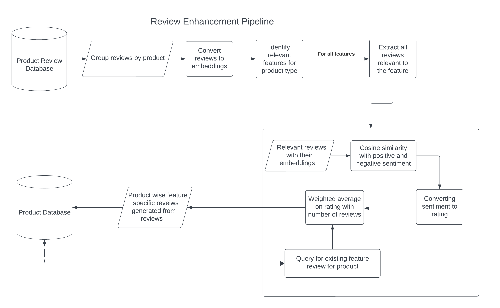
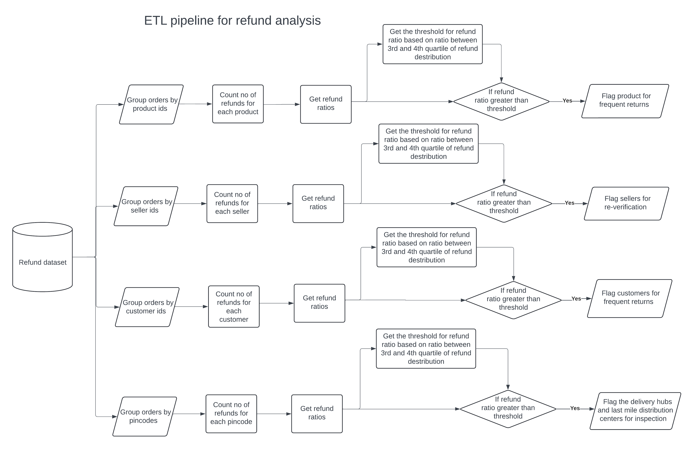
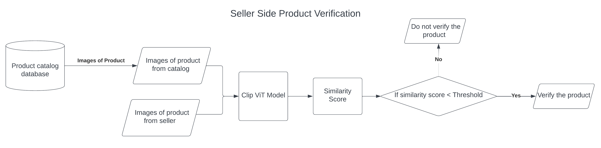

# TrustSync: Holistic E-Commerce Product Integrity Solution

## Overview
The project provides an integrated suite of solutions addressing critical challenges in the e-commerce ecosystem, including product review enhancement, refund and delivery analysis, and seller product verification. By leveraging multi-source datasets and advanced machine learning models, TrustSync aims to improve product trust, customer experience, and seller authenticity across diverse e-commerce platforms.

---

## File Structure

| File/Folder                   | Description                                                        |
|------------------------------|--------------------------------------------------------------------|
| `review-enhancement-pipeline.ipynb`| Pipeline to process and enhance product reviews into feature-specific ratings using MPNet Base v2 embeddings. |
| `etl-pipeline-post-order-analysis.ipynb` | ETL pipeline focused on analyzing delays, refunds and return-related patterns.            |
| `seller-verification-pipeline.ipynb`| Pipeline for verifying seller product images against catalog images using Clip ViT L-14.|
| `customer complain analysis`| Contains code for reddit scrapper and analysis on the reviews|

---

## Technologies and Methodologies

### Review Enhancement Pipeline
- **Data Sources:** Flipkart and Olist product review datasets.
- **Model:** all-mpnet-base-v2 for generating 768-dimensional review embeddings.
- **Methodology:** Semantic similarity and sentiment labeling using cosine similarity with positive and negative sentiment embeddings. User-friendly feature-wise rating calculation via weighted averages.
- **Architecture Diagram:** 

### ETL Pipeline for Refund Analysis
- **Data Sources:** Amazon US order data (March 2020 – December 2021) for estimating customer/seller statistics and refund patterns.
- **Methodology:** Statistical analysis for identifying sellers with faulty products, customers with high return rates, and zones with delayed deliveries based on order/refund status and delivery timestamps.
- **Architecture Diagram:** 

### Seller Verification Pipeline
- **Data Sources:** Images from product catalog and seller-uploaded product images.
- **Model:** CLIP Vision Transformer (ViT) Large to compute similarity scores between catalog and seller images.
- **Methodology:** Products are verified based on similarity scores exceeding a threshold; otherwise flagged for manual check.
- **Architecture Diagram:** 

### Data sets used -
- [Flipkart product review dataset](https://www.kaggle.com/datasets/niraliivaghani/flipkart-dataset "Flipkart product review dataset on Kaggle")
- [Olist Dataset](https://www.kaggle.com/datasets/olistbr/brazilian-ecommerce "Brazilian eCommerce dataset on Kaggle")

